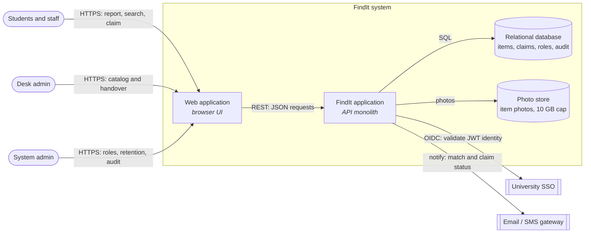

# Container diagram

```mermaid
flowchart LR
    student([Students and staff])
    desk([Desk admin])
    sysadmin([System admin])

    subgraph findit [FindIt system]
        web[Web application<br/><i>browser UI</i>]
        api[FindIt application<br/><i>API monolith</i>]
        db[(Relational database<br/>items, claims, roles, audit)]
        photos[(Photo store<br/>item photos, 10 GB cap)]
    end

    sso[[University SSO]]
    notify[[Email / SMS gateway]]

    student -- "HTTPS: report, search, claim" --> web
    desk -- "HTTPS: catalog and handover" --> web
    sysadmin -- "HTTPS: roles, retention, audit" --> web
    web -- "REST: JSON requests" --> api
    api -- "SQL" --> db
    api -- "photos" --> photos
    api -- "OIDC: validate JWT identity" --> sso
    api -- "notify: match and claim status" --> notify
```

The load balancer runs two instances of the FindIt application for availability;
it is a deployment mechanism, not a separate container.
